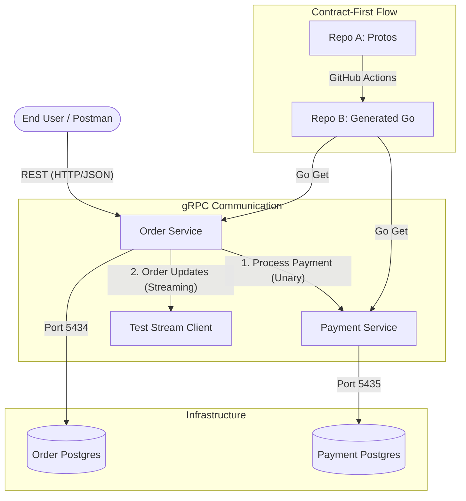

# Assignment 1 - Go Microservices (gRPC Migration)

Main development branch: `grpc-migration`

This repository contains a microservice architecture in Go with:
- `order-service`
- `payment-service`
- shared protobuf contracts in `proto-repo`
- a streaming test client in `test-stream`

Communication between services is implemented via gRPC.

## Contract-First Flow

- Repository A (Protos): `https://github.com/doni9977/ass2go`
- Repository B (Generated Code): `https://github.com/doni9977/ass2go-gen`

Workflow:
1. `.proto` contracts are maintained in Repository A.
2. GitHub Actions generates Go code from contracts.
3. Generated code is pushed to Repository B.
4. Services consume generated contracts via Go modules (`go get`).

## Implemented Features

- Order Service:
  - REST endpoint for order creation
  - gRPC unary call to Payment Service for payment processing
  - gRPC server streaming for order status updates
- Payment Service:
  - gRPC handlers for payment processing
  - logging interceptor for all gRPC calls

## Ports and Endpoints

- Order Service HTTP: `8080`
- Order Service gRPC: `50051`
- Payment Service gRPC: `50052`
- Order Postgres mapped port: `5434`
- Payment Postgres mapped port: `5435`

## Architecture Diagram



## Setup

### 1. Start Databases (Docker)

```bash
# Order DB
docker run -d --name order-postgres -e POSTGRES_USER=user -e POSTGRES_PASSWORD=pass -e POSTGRES_DB=orderdb -p 5434:5432 postgres:16

# Payment DB
docker run -d --name payment-postgres -e POSTGRES_USER=user -e POSTGRES_PASSWORD=pass -e POSTGRES_DB=paymentdb -p 5435:5432 postgres:16
```

### 2. Apply Migrations

```bash
docker exec -i order-postgres psql -U user -d orderdb < order-service/migrations/up.sql
docker exec -i payment-postgres psql -U user -d paymentdb < payment-service/migrations/up.sql
```

### 3. Run Services

Run in separate terminals:

```bash
go run payment-service/cmd/payment-service/main.go
go run order-service/cmd/order-service/main.go
```

## Testing

### 1. Create Order (REST -> gRPC Unary)

Send `POST` request to:

`http://localhost:8080/orders`

Body:

```json
{
  "customer_id": "user_123",
  "item_name": "Laptop",
  "amount": 55000
}
```

### 2. Check gRPC Server Streaming

```bash
cd test-stream && go run main.go
```

## Notes

- This README was created as a new root-level file and does not modify existing README files inside services.
- Suitable for university submission with setup, architecture, and test instructions.


# Assignment 3 - Event-Driven Architecture

## Architecture Diagram
```mermaid
graph TD
    Client -->|REST/gRPC| OrderService
    OrderService -->|gRPC| PaymentService
    PaymentService -->|Publish payment.completed| RabbitMQ
    RabbitMQ -->|Consume| NotificationService